# AWS-Specific Architecture Diagram
# Detailed AWS implementation with specific service names

```mermaid
%%{init: {'theme':'base', 'themeVariables': { 'primaryColor':'#FF9900','secondaryColor':'#FFB84D','tertiaryColor':'#FFC266'}}}%%

graph TB
    subgraph Internet["🌐 Internet"]
        SFTP["Legacy SFTP Server<br/>Port 22"]
    end

    subgraph AWS["☁️ AWS Cloud - us-east-1"]
        
        subgraph VPC["Amazon VPC<br/>CIDR: 10.0.0.0/16<br/>✓ DNS Hostnames Enabled"]
            
            subgraph AZ1["Availability Zone 1a"]
                subgraph PrivateSubnet1["Private Subnet<br/>10.0.1.0/24<br/>❌ No Internet Gateway"]
                    Lambda1["AWS Lambda<br/>Runtime: Python 3.11<br/>Memory: 512 MB<br/>Timeout: 300s<br/>VPC-Enabled"]
                end
            end
            
            subgraph AZ2["Availability Zone 1b"]
                subgraph PrivateSubnet2["Private Subnet<br/>10.0.2.0/24<br/>❌ No Internet Gateway"]
                    Lambda2["AWS Lambda<br/>(Standby Instance)"]
                end
            end
            
            subgraph Networking["VPC Networking"]
                RouteTable["Route Table<br/>Private Routes Only"]
                SecurityGroup["Security Group<br/>sg-lambda-file-transfer<br/>Egress: HTTPS (443)<br/>Egress: SSH (22)"]
            end
            
            subgraph GatewayEndpoint["💰 S3 VPC Gateway Endpoint<br/>⭐ FREE - No Hourly Charge<br/>⭐ FREE - No Data Transfer Charge"]
                S3Endpoint["com.amazonaws.us-east-1.s3<br/>Type: Gateway<br/>Auto Route Table Updates"]
                EndpointPolicy["Endpoint Policy<br/>Least Privilege S3 Access"]
            end
        end
        
        subgraph S3["Amazon S3"]
            S3Bucket["S3 Bucket<br/>bucket-name-files<br/>✓ Versioning Enabled<br/>✓ SSE-AES256 Encryption<br/>✓ Bucket Key Enabled<br/>✓ Public Access Blocked"]
            
            subgraph Lifecycle["S3 Lifecycle Policy"]
                Standard["Standard<br/>$0.023/GB"]
                StandardIA["Standard-IA<br/>Day 30<br/>$0.0125/GB<br/>(46% savings)"]
                GlacierIR["Glacier IR<br/>Day 90<br/>$0.004/GB<br/>(83% savings)"]
                DeepArchive["Deep Archive<br/>Day 180<br/>$0.00099/GB<br/>(96% savings)"]
            end
        end
        
        subgraph IAM["AWS IAM"]
            LambdaRole["IAM Role<br/>lambda-file-transfer-role<br/>Trust: lambda.amazonaws.com"]
            
            subgraph Policies["IAM Policies"]
                S3Policy["S3 Access Policy<br/>- s3:PutObject<br/>- s3:GetObject<br/>- s3:ListBucket"]
                LogsPolicy["CloudWatch Logs<br/>AWSLambdaBasicExecutionRole"]
                VPCPolicy["VPC Access<br/>AWSLambdaVPCAccessExecutionRole"]
                SecretsPolicy["Secrets Manager<br/>- secretsmanager:GetSecretValue"]
            end
        end
        
        subgraph SecretsManager["AWS Secrets Manager"]
            Secret["Secret: sftp-credentials<br/>$0.40/month<br/>Encrypted Storage<br/>JSON: {username, password, host, port}"]
        end
        
        subgraph CloudWatch["Amazon CloudWatch"]
            LogGroup["Log Group<br/>/aws/lambda/file-transfer<br/>Retention: 7 days<br/>$0.05/month"]
            Metrics["Metrics<br/>- Invocations<br/>- Duration<br/>- Errors<br/>- Throttles"]
            Alarm["Alarm<br/>Errors > 5 in 5 min<br/>$0.10/month"]
        end
        
        subgraph EventBridge["Amazon EventBridge"]
            Rule["Event Rule<br/>Schedule: cron(0 2 * * ? *)<br/>Daily at 2 AM UTC<br/>FREE for scheduled rules"]
        end
    end

    %% Data Flow
    Rule -->|"1. Scheduled Trigger"| Lambda1
    Lambda1 -->|"2. Get SFTP Credentials"| Secret
    Lambda1 -.->|"3. SSH/SFTP Connection<br/>Port 22 (Internet)"| SFTP
    SFTP -.->|"4. Download Files"| Lambda1
    Lambda1 -->|"5. Upload via Private Endpoint<br/>HTTPS - No Internet!"| S3Endpoint
    S3Endpoint -->|"Private AWS Network<br/>FREE Data Transfer"| S3Bucket
    S3Bucket -->|"Automatic Transition"| Standard
    Standard -->|"30 days"| StandardIA
    StandardIA -->|"90 days"| GlacierIR
    GlacierIR -->|"180 days"| DeepArchive
    Lambda1 -->|"6. Write Logs"| LogGroup
    Lambda1 -->|"Emit Metrics"| Metrics
    Metrics -->|"Trigger on Threshold"| Alarm
    
    %% IAM Relationships
    Lambda1 -.->|"Assumes"| LambdaRole
    LambdaRole -.->|"Attached"| S3Policy
    LambdaRole -.->|"Attached"| LogsPolicy
    LambdaRole -.->|"Attached"| VPCPolicy
    LambdaRole -.->|"Attached"| SecretsPolicy
    
    %% Network Relationships
    SecurityGroup -.->|"Controls Traffic"| Lambda1
    RouteTable -.->|"Routes S3 Traffic"| S3Endpoint
    EndpointPolicy -.->|"Restricts Access"| S3Endpoint

    %% Styling
    classDef awsOrange fill:#FF9900,stroke:#CC7A00,stroke-width:3px,color:#000
    classDef awsCompute fill:#ED7100,stroke:#BD5A00,stroke-width:2px,color:#fff
    classDef awsStorage fill:#3F8624,stroke:#2F6518,stroke-width:2px,color:#fff
    classDef awsSecurity fill:#DD344C,stroke:#AD2A3C,stroke-width:2px,color:#fff
    classDef awsMonitor fill:#759C3E,stroke:#5C7C31,stroke-width:2px,color:#fff
    classDef awsNetwork fill:#5294CF,stroke:#4275A6,stroke-width:2px,color:#fff
    classDef awsCostSaver fill:#00D1B2,stroke:#00A68C,stroke-width:4px,color:#000
    
    class AWS awsOrange
    class Lambda1,Lambda2,Rule awsCompute
    class S3Bucket,Standard,StandardIA,GlacierIR,DeepArchive awsStorage
    class LambdaRole,S3Policy,LogsPolicy,VPCPolicy,SecretsPolicy,Secret,SecurityGroup awsSecurity
    class LogGroup,Metrics,Alarm awsMonitor
    class VPC,RouteTable,PrivateSubnet1,PrivateSubnet2 awsNetwork
    class S3Endpoint,EndpointPolicy,GatewayEndpoint awsCostSaver
```



## AWS Architecture Details

### 🏗️ Infrastructure Components

#### 1. **Amazon VPC**
- **CIDR**: 10.0.0.0/16
- **DNS**: Enabled for hostname resolution
- **Cost**: FREE
- **Documentation**: [AWS VPC](https://aws.amazon.com/vpc/)

#### 2. **Private Subnets** (Multi-AZ)
- **Subnet 1**: 10.0.1.0/24 (us-east-1a)
- **Subnet 2**: 10.0.2.0/24 (us-east-1b)
- **Internet Access**: None (for S3)
- **Cost**: FREE

#### 3. **AWS Lambda Function** ⚡
- **Runtime**: Python 3.11
- **Memory**: 512 MB
- **Timeout**: 300 seconds
- **VPC Config**: Attached to private subnets
- **Environment Variables**:
  ```
  S3_BUCKET_NAME=bucket-name
  SFTP_SECRET_ARN=arn:aws:secretsmanager:...
  SFTP_REMOTE_PATH=/sftp/files
  LOG_LEVEL=INFO
  ```
- **Cost**: $0.0000166667 per GB-second + $0.20 per 1M requests
- **Estimated**: $0.25/month for 1000 executions

#### 4. **S3 VPC Gateway Endpoint** 💰⭐ KEY FEATURE
- **Service**: com.amazonaws.us-east-1.s3
- **Type**: Gateway (not Interface)
- **Route Table**: Automatically updated
- **Data Transfer**: FREE (stays in AWS network)
- **Hourly Charge**: FREE
- **Cost Savings**: $32.40/month vs NAT Gateway
- **Documentation**: [S3 Gateway Endpoints](https://docs.aws.amazon.com/vpc/latest/privatelink/vpc-endpoints-s3.html)

#### 5. **Amazon S3 Bucket** 💾
- **Versioning**: Enabled
- **Encryption**: SSE-S3 (AES-256)
- **Bucket Key**: Enabled (99% reduction in KMS costs)
- **Public Access**: Blocked (all 4 settings)
- **Storage Classes**:
  - **Standard**: $0.023/GB/month
  - **Standard-IA** (30 days): $0.0125/GB/month
  - **Glacier IR** (90 days): $0.004/GB/month
  - **Deep Archive** (180 days): $0.00099/GB/month

#### 6. **IAM Role and Policies** 🔐
- **Role**: lambda-file-transfer-role
- **Trust Policy**: lambda.amazonaws.com
- **Attached Policies**:
  - Custom S3 access policy
  - AWSLambdaBasicExecutionRole (managed)
  - AWSLambdaVPCAccessExecutionRole (managed)
  - Custom Secrets Manager policy

#### 7. **AWS Secrets Manager** 🔑
- **Secret**: sftp-credentials
- **Format**: JSON
  ```json
  {
    "username": "sftp_user",
    "password": "encrypted_password",
    "host": "sftp.example.com",
    "port": 22
  }
  ```
- **Cost**: $0.40/month per secret
- **Rotation**: Optional (can be automated)

#### 8. **Amazon CloudWatch** 📊
- **Log Group**: /aws/lambda/file-transfer
- **Retention**: 7 days (development), 30+ days (production)
- **Metrics**: Invocations, Duration, Errors, Throttles
- **Alarms**: Trigger on >5 errors in 5 minutes
- **Cost**: 
  - Logs: $0.50/GB ingested, $0.03/GB stored
  - Alarms: $0.10/month each

#### 9. **Amazon EventBridge** ⏰
- **Rule Type**: Schedule
- **Expression**: cron(0 2 * * ? *)
- **Target**: Lambda function
- **Cost**: FREE for scheduled rules

### 📊 Cost Breakdown

| Service | Monthly Cost | Notes |
|---------|-------------|-------|
| Lambda | $0.25 | 1000 executions @ 30s each |
| S3 Storage (100GB) | $2.30 | With lifecycle transitions |
| S3 Requests | $0.01 | 1000 PUTs |
| Secrets Manager | $0.40 | 1 secret |
| CloudWatch Logs | $0.05 | 1GB logs, 7-day retention |
| CloudWatch Alarm | $0.10 | 1 alarm |
| VPC | $0.00 | FREE |
| **S3 Gateway Endpoint** | **$0.00** | ⭐ **FREE!** |
| **Total** | **$3.11/month** | |

**Annual Cost**: $37.32/year

**Savings vs NAT Gateway**: $32.40/month ($388.80/year) = **91% cost reduction**

### 🔒 Security Features

#### Network Security
- ✅ Lambda in private subnets (no internet gateway)
- ✅ S3 Gateway Endpoint (traffic never leaves AWS network)
- ✅ Security group with restrictive egress rules
- ✅ VPC endpoint policy for least privilege

#### Data Security
- ✅ S3 encryption at rest (SSE-S3 AES-256)
- ✅ TLS/HTTPS for data in transit
- ✅ S3 versioning for data protection
- ✅ Public access blocked on S3 bucket

#### Identity Security
- ✅ IAM role (no access keys in code)
- ✅ Least privilege IAM policies
- ✅ Secrets Manager for credentials
- ✅ MFA delete (optional) for S3 objects

#### Monitoring Security
- ✅ CloudWatch Logs for audit trail
- ✅ CloudWatch Alarms for anomaly detection
- ✅ CloudTrail (optional) for API logging
- ✅ VPC Flow Logs (optional) for network monitoring

### 🚀 Deployment

#### Terraform
```bash
cd terraform
terraform init
terraform plan -out=tfplan
terraform apply tfplan
```

#### AWS CLI
```bash
# Package Lambda
cd lambda
zip -r ../lambda_function.zip .

# Update function code
aws lambda update-function-code \
  --function-name file-transfer-function \
  --zip-file fileb://lambda_function.zip

# Invoke function
aws lambda invoke \
  --function-name file-transfer-function \
  output.json

# View logs
aws logs tail /aws/lambda/file-transfer-function --follow
```

### 📈 Monitoring

#### CloudWatch Insights Queries

**Error Analysis**:
```sql
fields @timestamp, @message
| filter @message like /ERROR/
| sort @timestamp desc
| limit 100
```

**Performance Stats**:
```sql
fields @timestamp, @duration, @memorySize / 1000000 as memoryUsedMB
| stats avg(@duration), max(@duration), avg(memoryUsedMB), max(memoryUsedMB) 
by bin(5m)
```

**Success Rate**:
```sql
fields @timestamp, @message
| filter @message like /File transferred successfully/
| stats count() by bin(1h)
```

### 🎯 Best Practices

1. **Use S3 Gateway Endpoint** instead of NAT Gateway for 91% cost savings
2. **Enable S3 Bucket Key** to reduce KMS costs by 99%
3. **Configure Lifecycle Policies** for up to 96% storage savings
4. **Set CloudWatch Log Retention** to minimum required (7 days for dev)
5. **Use IAM Roles** instead of access keys
6. **Tag All Resources** for cost allocation
7. **Enable Versioning** for data protection
8. **Block Public Access** on S3 buckets
9. **Use Security Groups** for network-level access control
10. **Monitor with CloudWatch Alarms** for proactive issue detection

### 🔄 High Availability

- **Multi-AZ Deployment**: Lambda in 2+ availability zones
- **S3 Durability**: 99.999999999% (11 9's)
- **Automatic Failover**: Lambda automatically handles AZ failures
- **No Single Point of Failure**: All components are highly available

### 📝 Additional Resources

- [AWS Lambda in VPC](https://docs.aws.amazon.com/lambda/latest/dg/configuration-vpc.html)
- [S3 Gateway Endpoints](https://docs.aws.amazon.com/vpc/latest/privatelink/vpc-endpoints-s3.html)
- [AWS Well-Architected Framework](https://aws.amazon.com/architecture/well-architected/)
- [DEA-C01 Exam Guide](https://aws.amazon.com/certification/certified-data-engineer-associate/)
