# Azure-Specific Architecture Diagram
# Detailed Microsoft Azure implementation

```mermaid
%%{init: {'theme':'base', 'themeVariables': { 'primaryColor':'#0078D4','secondaryColor':'#50E6FF','tertiaryColor':'#00BCF2'}}}%%

graph TB
    subgraph Internet["🌐 Internet"]
        SFTP["Legacy SFTP Server<br/>Port 22"]
    end

    subgraph Azure["☁️ Microsoft Azure - East US"]
        
        subgraph ResourceGroup["Resource Group<br/>rg-secure-file-transfer"]
            
            subgraph VNet["Virtual Network (VNet)<br/>Address Space: 10.0.0.0/16"]
                
                subgraph Subnet1["Subnet<br/>10.0.1.0/24<br/>Service Endpoint: Microsoft.Storage"]
                    FunctionApp["Azure Functions<br/>Plan: Consumption<br/>Runtime: Python 3.11<br/>Memory: 512 MB<br/>Timeout: 300s<br/>VNet Integration: Enabled"]
                end
                
                subgraph NetworkSecurity["Network Security"]
                    NSG["Network Security Group<br/>nsg-function-app<br/>Outbound: HTTPS (443) to Storage<br/>Outbound: SSH (22) to Any"]
                end
                
                subgraph ServiceEndpoint["💰 Storage Service Endpoint<br/>⭐ FREE - No Additional Cost<br/>⭐ FREE - No Data Transfer Charge"]
                    Endpoint["Microsoft.Storage<br/>Type: Service Endpoint<br/>Traffic stays on Azure backbone<br/>Optimal routing to Storage"]
                end
                
                subgraph PrivateEndpointAlt["Alternative: Private Endpoint<br/>$7.30/month (more isolation)"]
                    PE["Private Endpoint<br/>Private IP in VNet<br/>DNS: privatelink.blob.core.windows.net"]
                end
            end
            
            subgraph BlobStorage["Azure Blob Storage"]
                StorageAccount["Storage Account<br/>stfiletransfer<br/>Tier: Standard<br/>Replication: LRS<br/>TLS: 1.2 minimum<br/>✓ Encryption at rest (automatic)<br/>✓ HTTPS only<br/>✓ No nested public items"]
                
                Container["Blob Container: files<br/>Access: Private"]
                
                subgraph Lifecycle["Lifecycle Management"]
                    Hot["Hot Tier<br/>$0.0184/GB"]
                    Cool["Cool Tier<br/>Day 30<br/>$0.01/GB<br/>(46% savings)"]
                    Archive["Archive Tier<br/>Day 90<br/>$0.00099/GB<br/>(95% savings)"]
                end
                
                NetworkRules["Network Rules<br/>Default: Deny<br/>Allow: Specific VNet/Subnet<br/>Bypass: Azure Services"]
            end
            
            subgraph Identity["Azure Managed Identity"]
                ManagedIdentity["System-Assigned<br/>Managed Identity<br/>Auto-created with Function App<br/>No credentials to manage"]
                
                subgraph RBAC["Azure Role-Based Access Control"]
                    StorageRole["Storage Blob Data Contributor<br/>Scope: Storage Account"]
                    KeyVaultRole["Key Vault Secrets User<br/>Scope: Key Vault"]
                    MonitorRole["Monitoring Metrics Publisher<br/>Scope: Resource Group"]
                end
            end
            
            subgraph KeyVault["Azure Key Vault"]
                Vault["Key Vault: kv-file-transfer<br/>SKU: Standard<br/>RBAC Authorization: Enabled<br/>Soft Delete: 90 days<br/>$0.05/month"]
                
                Secret["Secret: sftp-credentials<br/>JSON: {username, password, host, port}"]
            end
            
            subgraph Monitoring["Azure Monitor"]
                LogAnalytics["Log Analytics Workspace<br/>log-file-transfer<br/>SKU: Pay-as-you-go<br/>Retention: 30 days<br/>First 5GB: FREE"]
                
                AppInsights["Application Insights<br/>appi-file-transfer<br/>Type: Web<br/>First 5GB: FREE<br/>Telemetry & Performance"]
                
                DiagnosticSettings["Diagnostic Settings<br/>Logs: FunctionAppLogs<br/>Metrics: AllMetrics"]
                
                MetricAlert["Metric Alert<br/>Metric: FunctionExecutionCount<br/>Threshold: > 5 errors<br/>$0.10/month"]
            end
            
            subgraph Automation["Automation"]
                LogicApp["Logic Apps (Consumption)<br/>Trigger: Recurrence<br/>Frequency: Daily<br/>Start: 2 AM UTC<br/>Action: Call Function App<br/>$0.075/month"]
                
                FunctionTimer["Alternative: Function Timer Trigger<br/>Schedule: 0 0 2 * * *<br/>FREE (no additional cost)"]
            end
        end
    end

    %% Data Flow
    LogicApp -->|"1. HTTP POST Trigger"| FunctionApp
    FunctionApp -->|"2. Get SFTP Credentials<br/>using Managed Identity"| Secret
    FunctionApp -.->|"3. SSH/SFTP Connection<br/>Port 22 (Internet)"| SFTP
    SFTP -.->|"4. Download Files"| FunctionApp
    FunctionApp -->|"5. Upload via VNet Integration"| Endpoint
    Endpoint -->|"Service Endpoint<br/>Azure Backbone Network<br/>FREE"| StorageAccount
    StorageAccount -->|"Store in"| Container
    Container -->|"Automatic Transition"| Hot
    Hot -->|"30 days"| Cool
    Cool -->|"90 days"| Archive
    FunctionApp -->|"6. Write Logs"| LogAnalytics
    FunctionApp -->|"Send Telemetry"| AppInsights
    AppInsights -->|"Check Metrics"| MetricAlert
    
    %% IAM Relationships
    FunctionApp -.->|"Uses"| ManagedIdentity
    ManagedIdentity -.->|"Assigned"| StorageRole
    ManagedIdentity -.->|"Assigned"| KeyVaultRole
    ManagedIdentity -.->|"Assigned"| MonitorRole
    
    %% Network Relationships
    NSG -.->|"Controls Traffic"| FunctionApp
    Subnet1 -.->|"Has"| Endpoint
    NetworkRules -.->|"Restricts Access"| StorageAccount
    DiagnosticSettings -.->|"Sends to"| LogAnalytics

    %% Styling
    classDef azureBlue fill:#0078D4,stroke:#005A9E,stroke-width:3px,color:#fff
    classDef azureCompute fill:#0089D6,stroke:#006BB8,stroke-width:2px,color:#fff
    classDef azureStorage fill:#0072C6,stroke:#005A9E,stroke-width:2px,color:#fff
    classDef azureSecurity fill:#E81123,stroke:#C50F1F,stroke-width:2px,color:#fff
    classDef azureMonitor fill:#FFB900,stroke:#D39300,stroke-width:2px,color:#000
    classDef azureNetwork fill:#7FBA00,stroke:#68A100,stroke-width:2px,color:#fff
    classDef azureCostSaver fill:#00D1B2,stroke:#00A68C,stroke-width:4px,color:#000
    
    class Azure azureBlue
    class FunctionApp,LogicApp,FunctionTimer azureCompute
    class StorageAccount,Container,Hot,Cool,Archive azureStorage
    class ManagedIdentity,StorageRole,KeyVaultRole,MonitorRole,Vault,Secret,NSG,NetworkRules azureSecurity
    class LogAnalytics,AppInsights,DiagnosticSettings,MetricAlert azureMonitor
    class VNet,Subnet1 azureNetwork
    class Endpoint,ServiceEndpoint azureCostSaver
```



## Azure Architecture Details

### 🏗️ Infrastructure Components

#### 1. **Azure Virtual Network (VNet)**
- **Address Space**: 10.0.0.0/16
- **Subnets**: 10.0.1.0/24 (with Service Endpoint)
- **Cost**: FREE
- **Documentation**: [Azure VNet](https://azure.microsoft.com/en-us/pricing/details/virtual-network/)

#### 2. **Storage Service Endpoint** 💰⭐ KEY FEATURE
- **Type**: VNet Service Endpoint for Microsoft.Storage
- **Configuration**: Enabled on subnet
- **Traffic Path**: Azure backbone network (never leaves)
- **Data Transfer Cost**: **FREE**
- **Hourly Charge**: **FREE**
- **Equivalent to**: AWS S3 Gateway Endpoint, GCP Private Google Access
- **Documentation**: [Service Endpoints](https://docs.microsoft.com/en-us/azure/virtual-network/virtual-network-service-endpoints-overview)

**Alternative**: Private Endpoint ($7.30/month) for even more isolation

#### 3. **Azure Functions** ⚡
- **Plan**: Consumption (most cost-effective)
- **Runtime**: Python 3.11
- **Memory**: 512 MB
- **Timeout**: 300s (5 minutes)
- **VNet Integration**: Regional VNet Integration enabled
- **Environment Variables**:
  ```
  STORAGE_ACCOUNT_NAME=stfiletransfer
  KEY_VAULT_URI=https://kv-file-transfer.vault.azure.net/
  SFTP_REMOTE_PATH=/sftp/files
  LOG_LEVEL=INFO
  ```
- **Cost**:
  - Execution: $0.20 per 1M executions
  - Compute: $0.000016 per GB-second
  - Estimated: $0.25/month for 1000 executions
- **Identity**: System-assigned Managed Identity

**Alternative Plans**:
- **Premium (EP1)**: $143/month (always-on, faster cold start, VNet integration)
- **Dedicated**: $78+/month (dedicated compute)

#### 4. **Azure Blob Storage** 💾
- **Storage Account**: stfiletransfer (globally unique name)
- **Tier**: Standard
- **Replication**: LRS (Locally Redundant Storage)
- **Container**: files (private access)
- **Features**:
  - Encryption at rest (automatic, Microsoft-managed keys)
  - HTTPS only (TLS 1.2 minimum)
  - Versioning enabled
  - Public access prevention
  - Network rules (allow specific VNet/subnet)
- **Storage Pricing**:
  - **Hot**: $0.0184/GB/month
  - **Cool** (30 days): $0.01/GB/month (46% savings)
  - **Archive** (90 days): $0.00099/GB/month (95% savings)

#### 5. **Azure Managed Identity** 🔐
- **Type**: System-assigned (auto-created with Function App)
- **Benefit**: No credentials to manage, rotate, or secure
- **Azure RBAC Roles**:
  - **Storage Blob Data Contributor**: Read/write access to blob storage
  - **Key Vault Secrets User**: Read secrets from Key Vault
  - **Monitoring Metrics Publisher**: Send metrics to Azure Monitor
- **Cost**: FREE

#### 6. **Azure Key Vault** 🔑
- **Name**: kv-file-transfer
- **SKU**: Standard
- **RBAC**: Enabled (instead of access policies)
- **Soft Delete**: 90 days retention
- **Secret**: sftp-credentials
  ```json
  {
    "username": "sftp_user",
    "password": "encrypted_password",
    "host": "sftp.example.com",
    "port": 22
  }
  ```
- **Cost**: $0.03 per 10,000 operations (~$0.05/month)

#### 7. **Azure Monitor** 📊
- **Log Analytics Workspace**:
  - SKU: Pay-as-you-go
  - Ingestion: $2.76/GB (first 5GB FREE)
  - Retention: 31 days FREE, then $0.12/GB/month
  - Estimated: $0.05/month
- **Application Insights**:
  - Type: Web
  - Workspace-based
  - First 5GB FREE per month
  - Estimated: $0.00 (within free tier)
- **Diagnostic Settings**: Route logs and metrics to Log Analytics
- **Metric Alerts**: $0.10/month per alert

#### 8. **Automation** ⏰

**Option 1: Logic Apps (Consumption)**
- **Trigger**: Recurrence (daily at 2 AM)
- **Action**: HTTP POST to Function App
- **Cost**: $0.000025 per action × ~90 actions/month = $0.075/month

**Option 2: Function Timer Trigger** (Recommended)
- **Schedule**: cron expression (0 0 2 * * *)
- **Cost**: FREE (no additional cost beyond function execution)
- **Simpler**: Built into Azure Functions

#### 9. **Network Security Group (NSG)**
- **Name**: nsg-function-app
- **Rules**:
  - Allow HTTPS (443) outbound to Storage (using Service Tag)
  - Allow SSH (22) outbound to any (for SFTP)
- **Cost**: FREE (up to 100 rules)

### 📊 Cost Breakdown

#### Option 1: Consumption Plan with Service Endpoints (Recommended)
| Service | Monthly Cost | Notes |
|---------|-------------|-------|
| Azure Functions (Consumption) | $0.25 | 1000 executions @ 30s |
| Blob Storage (100GB) | $1.84 | With lifecycle transitions |
| Storage Requests | $0.01 | 1000 writes |
| Key Vault | $0.05 | 1 secret, ~1000 operations |
| Log Analytics | $0.05 | ~1GB logs |
| Application Insights | $0.00 | FREE tier |
| Logic Apps | $0.075 | OR use Function Timer (FREE) |
| **Service Endpoints** | **$0.00** | ⭐ **FREE!** |
| **Total** | **$2.28/month** | |

**Annual Cost**: $27.36/year

#### Option 2: Premium Plan (for always-on scenarios)
| Service | Monthly Cost |
|---------|-------------|
| Azure Functions (EP1) | $143.00 |
| Other services | $1.96 |
| **Total** | **$145.00/month** |

#### Option 3: Private Endpoints (more isolation)
| Service | Monthly Cost |
|---------|-------------|
| Azure Functions (Consumption) | $0.25 |
| Private Endpoint | $7.30 |
| Private Endpoint Data | $0.10 |
| Other services | $1.96 |
| **Total** | **$9.61/month** |

### 🔒 Security Features

#### Network Security
- ✅ Function App VNet integration
- ✅ Storage Service Endpoints on subnet
- ✅ NSG rules for restrictive outbound traffic
- ✅ Storage network rules restrict access to specific VNet
- ✅ No public IPs on compute resources

#### Data Security
- ✅ Automatic encryption at rest (AES-256)
- ✅ TLS 1.2 minimum enforced
- ✅ HTTPS only traffic
- ✅ Blob versioning enabled
- ✅ Public access disabled
- ✅ Soft delete for blobs (optional)

#### Identity Security
- ✅ Managed Identity (no credentials)
- ✅ Azure RBAC with least privilege
- ✅ Key Vault for secrets
- ✅ RBAC authorization on Key Vault
- ✅ No access keys in code or configuration

#### Monitoring Security
- ✅ Application Insights telemetry
- ✅ Diagnostic settings for audit logs
- ✅ Metric alerts for anomaly detection
- ✅ Log retention policies
- ✅ NSG Flow Logs (optional)

### 🚀 Deployment

#### Terraform
```bash
terraform init
terraform plan -out=tfplan
terraform apply tfplan
```

#### Azure CLI
```bash
# Login and set subscription
az login
az account set --subscription SUBSCRIPTION_ID

# Create resource group
az group create \
  --name rg-secure-file-transfer \
  --location eastus

# Deploy Function App (using Azure Functions Core Tools)
func azure functionapp publish func-file-transfer \
  --python

# Invoke function
az functionapp function invoke \
  --resource-group rg-secure-file-transfer \
  --name func-file-transfer \
  --function-name FileTransferFunction

# View logs (streaming)
az functionapp logs tail \
  --resource-group rg-secure-file-transfer \
  --name func-file-transfer

# View metrics
az monitor metrics list \
  --resource /subscriptions/SUB_ID/resourceGroups/rg-secure-file-transfer/providers/Microsoft.Web/sites/func-file-transfer \
  --metric FunctionExecutionCount
```

### 📈 Monitoring

#### Log Analytics KQL Queries

**Error Analysis**:
```kql
FunctionAppLogs
| where Level == "Error"
| project TimeGenerated, Message, ExceptionDetails
| order by TimeGenerated desc
| take 100
```

**Performance Stats**:
```kql
FunctionAppLogs
| where Message contains "Execution time"
| summarize avg(DurationMs), max(DurationMs) by bin(TimeGenerated, 5m)
```

**Success Rate**:
```kql
FunctionAppLogs
| where Message contains "File transferred successfully"
| summarize count() by bin(TimeGenerated, 1h)
```

### 🎯 Best Practices

1. **Use Service Endpoints (FREE)** instead of Private Endpoints for cost optimization
2. **Use Consumption plan** for infrequent workloads
3. **Enable Managed Identity** for authentication (no secrets in code)
4. **Configure storage network rules** to restrict access to specific VNets
5. **Enable blob versioning** for data protection
6. **Use lifecycle management** for cost optimization
7. **Set up Application Insights** for comprehensive monitoring
8. **Use Key Vault** with RBAC for secret management
9. **Enable diagnostic settings** for audit logging
10. **Tag all resources** for cost allocation and governance

### 💡 Cost Optimization Tips

#### Recommendation: Consumption Plan
- **Best for**: Infrequent workloads (daily/hourly)
- **Cost**: $2.28/month
- **Scaling**: Automatic
- **Cold start**: 1-2 seconds acceptable

#### When to Use Premium Plan
- **Best for**: Frequent executions, <1s response time required
- **Cost**: $143/month
- **Benefits**: No cold start, faster execution, always-on
- **Use case**: High-frequency file transfers

#### Service Endpoints vs Private Endpoints
- **Service Endpoints**: FREE, good for most scenarios
- **Private Endpoints**: $7.30/month, better isolation
- **Choice**: Use Service Endpoints unless compliance requires Private Endpoints

### 🔄 High Availability

- **Function App**: Auto-scales, redundant instances
- **Storage Account**: LRS (3 copies within datacenter) or GRS (6 copies across regions)
- **Key Vault**: Replicated across region
- **Automatic Failover**: Built into all Azure PaaS services

### 📝 Migration from AWS

| AWS Service | Azure Equivalent |
|-------------|------------------|
| VPC | Virtual Network (VNet) |
| Private Subnet | Subnet with Service Endpoints |
| Security Group | Network Security Group (NSG) |
| S3 Gateway Endpoint | Storage Service Endpoint (FREE) |
| Lambda | Azure Functions |
| S3 | Blob Storage |
| IAM Role | Managed Identity |
| Secrets Manager | Key Vault |
| CloudWatch Logs | Log Analytics / Application Insights |
| CloudWatch Metrics | Azure Monitor Metrics |
| EventBridge | Logic Apps / Function Timer Trigger |

### 📝 Migration from GCP

| GCP Service | Azure Equivalent |
|-------------|------------------|
| VPC Network | Virtual Network (VNet) |
| Subnet with Private Google Access | Subnet with Service Endpoints |
| Firewall Rules | Network Security Group (NSG) |
| Private Google Access | Storage Service Endpoint (FREE) |
| Cloud Functions | Azure Functions |
| Cloud Storage | Blob Storage |
| Service Account | Managed Identity |
| Secret Manager | Key Vault |
| Cloud Logging | Log Analytics / Application Insights |
| Cloud Monitoring | Azure Monitor |
| Cloud Scheduler | Logic Apps / Timer Trigger |

### 🌟 Azure-Specific Advantages

1. **Managed Identity**: No credentials to manage (simpler than AWS IAM roles)
2. **Application Insights**: Rich telemetry out of the box
3. **Consumption Plan**: True pay-per-execution (no minimum charges)
4. **Service Endpoints**: FREE alternative to Private Endpoints
5. **RBAC**: Unified access control across all services
6. **Integrated Monitoring**: Log Analytics + Application Insights
7. **Function Timer Trigger**: Built-in scheduling (no Logic Apps needed)
