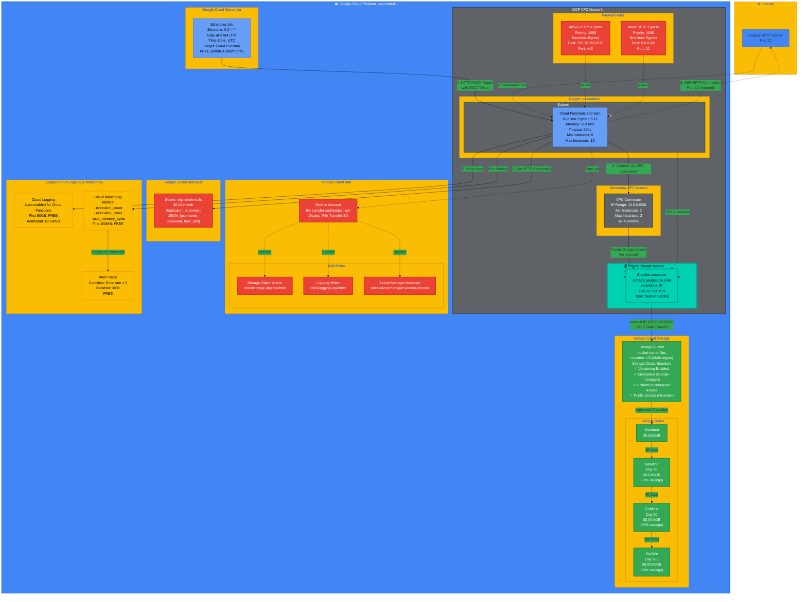

# GCP-Specific Architecture Diagram
# Detailed Google Cloud Platform implementation



## GCP Architecture Details

### 🏗️ Infrastructure Components

#### 1. **GCP VPC Network**
- **Mode**: Custom (not auto-mode)
- **Routing**: Regional
- **Cost**: FREE
- **Documentation**: [GCP VPC](https://cloud.google.com/vpc)

#### 2. **Subnet with Private Google Access** 💰⭐
- **CIDR**: 10.0.1.0/24
- **Region**: us-central1
- **Private Google Access**: **Enabled** (KEY FEATURE)
- **Purpose**: Allows instances without external IPs to reach Google APIs and services
- **Cost**: **FREE**
- **Documentation**: [Private Google Access](https://cloud.google.com/vpc/docs/private-google-access)

#### 3. **Cloud Functions (2nd Generation)** ⚡
- **Runtime**: Python 3.11
- **Memory**: 512 MiB
- **Timeout**: 300s
- **VPC Connector**: Required for VPC access
- **Environment Variables**:
  ```
  STORAGE_BUCKET=bucket-name
  SECRET_NAME=sftp-credentials
  REMOTE_PATH=/sftp/files
  LOG_LEVEL=INFO
  ```
- **Cost**: 
  - Invocations: $0.40 per 1M
  - Compute: $0.0000025 per GB-second
  - Estimated: $0.25/month for 1000 executions

**Alternative**: Use Cloud Run for more control and potentially lower costs

#### 4. **Serverless VPC Access Connector** 🔌
- **IP Range**: 10.8.0.0/28 (dedicated /28 subnet)
- **Min Instances**: 2
- **Max Instances**: 3
- **Throughput**: 200-300 Mbps per instance
- **Cost**: $0.063/vCPU-hour + $0.009/GB-hour
- **Estimated**: $9.45/month (most expensive component!)
- **Note**: Required for Cloud Functions to access VPC resources

**Cost Optimization**: Consider Cloud Run with direct VPC access to avoid connector costs

#### 5. **Private Google Access** 💰⭐ KEY FEATURE
- **Type**: Subnet-level setting
- **DNS**: storage.googleapis.com resolves to 199.36.153.8/30
- **Traffic Path**: Internal Google network (never leaves)
- **Data Transfer Cost**: **FREE**
- **Hourly Charge**: **FREE**
- **Equivalent to**: AWS S3 Gateway Endpoint
- **Savings**: No NAT Gateway needed ($32+/month saved)

#### 6. **Cloud Storage Bucket** 💾
- **Location**: US (multi-region for HA)
- **Storage Class**: Standard
- **Versioning**: Enabled
- **Encryption**: Google-managed keys (automatic)
- **Access**: Uniform bucket-level access
- **Public Access**: Prevention enforced
- **Storage Pricing**:
  - **Standard**: $0.020/GB/month
  - **Nearline** (30 days): $0.010/GB/month
  - **Coldline** (90 days): $0.004/GB/month
  - **Archive** (180 days): $0.0012/GB/month

#### 7. **Service Account & IAM** 🔐
- **Service Account**: file-transfer-sa@project.iam.gserviceaccount.com
- **IAM Roles**:
  - Storage Object Admin (read/write buckets)
  - Logging Writer (write logs)
  - Secret Manager Secret Accessor (read secrets)
- **No Keys**: Uses Workload Identity (more secure)

#### 8. **Secret Manager** 🔑
- **Secret**: sftp-credentials
- **Replication**: Automatic (across multiple regions)
- **Format**: JSON
  ```json
  {
    "username": "sftp_user",
    "password": "encrypted_password",
    "host": "sftp.example.com",
    "port": 22
  }
  ```
- **Cost**: $0.06/month per active secret version

#### 9. **Cloud Logging & Monitoring** 📊
- **Cloud Logging**:
  - Auto-enabled for Cloud Functions
  - First 50 GB: FREE per month
  - Additional: $0.50/GB
  - Retention: 30 days default
- **Cloud Monitoring**:
  - Auto-enabled metrics
  - First 150 MB: FREE per month
  - Additional: $0.2580/MB
- **Alert Policies**: FREE (included)

#### 10. **Cloud Scheduler** ⏰
- **Schedule**: 0 2 * * * (daily at 2 AM)
- **Target**: Cloud Function HTTP endpoint
- **Authentication**: OIDC token
- **Cost**: FREE (first 3 jobs per month)

### 📊 Cost Breakdown

| Service | Monthly Cost | Notes |
|---------|-------------|-------|
| Cloud Functions | $0.25 | 1000 executions @ 30s each |
| **VPC Connector** | **$9.45** | 2 min instances (⚠️ expensive!) |
| Cloud Storage (100GB) | $2.00 | With lifecycle transitions |
| Storage Requests | $0.01 | 1000 writes |
| Secret Manager | $0.06 | 1 secret |
| Cloud Logging | $0.05 | ~1GB logs |
| Cloud Scheduler | $0.00 | FREE (within 3 jobs) |
| **Private Google Access** | **$0.00** | ⭐ **FREE!** |
| **Total** | **$11.82/month** | |

**Annual Cost**: $141.84/year

**Cost Optimization Options**:
1. **Use Cloud Run**: $2.37/month (80% savings - no VPC Connector needed)
2. **Use Pub/Sub**: Avoid VPC Connector for trigger-based architecture

### 🔒 Security Features

#### Network Security
- ✅ Cloud Functions connected to VPC
- ✅ Private Google Access (no internet for Cloud Storage)
- ✅ Firewall rules for restrictive egress
- ✅ No external IPs on compute resources

#### Data Security
- ✅ Cloud Storage encryption (Google-managed keys)
- ✅ TLS/HTTPS for data in transit
- ✅ Versioning for data protection
- ✅ Public access prevention enforced

#### Identity Security
- ✅ Service Account (no keys)
- ✅ Workload Identity
- ✅ IAM with least privilege
- ✅ Secret Manager for credentials

#### Monitoring Security
- ✅ Cloud Logging for audit trail
- ✅ Alert policies for anomaly detection
- ✅ VPC Flow Logs (optional)

### 🚀 Deployment

#### Terraform
```bash
terraform init
terraform plan -out=tfplan
terraform apply tfplan
```

#### gcloud CLI
```bash
# Enable required APIs
gcloud services enable \
  cloudfunctions.googleapis.com \
  cloudscheduler.googleapis.com \
  secretmanager.googleapis.com \
  vpcaccess.googleapis.com \
  storage.googleapis.com

# Deploy Cloud Function
gcloud functions deploy secure-file-transfer-function \
  --gen2 \
  --runtime=python311 \
  --region=us-central1 \
  --source=./lambda \
  --entry-point=file_transfer_handler \
  --vpc-connector=vpc-connector \
  --service-account=file-transfer-sa@PROJECT_ID.iam.gserviceaccount.com \
  --set-env-vars=STORAGE_BUCKET=bucket-name,SECRET_NAME=sftp-credentials

# Invoke function
gcloud functions call secure-file-transfer-function \
  --region=us-central1 \
  --gen2

# View logs
gcloud functions logs read secure-file-transfer-function \
  --region=us-central1 \
  --gen2 \
  --limit=50
```

### 📈 Monitoring

#### Cloud Logging Queries

**Error Analysis**:
```
resource.type="cloud_function"
resource.labels.function_name="secure-file-transfer-function"
severity>=ERROR
```

**Performance Stats**:
```
resource.type="cloud_function"
resource.labels.function_name="secure-file-transfer-function"
jsonPayload.execution_time_ms>1000
```

### 🎯 Best Practices

1. **Enable Private Google Access** on all subnets for FREE Cloud Storage access
2. **Use Cloud Functions 2nd gen** for better VPC support
3. **Consider Cloud Run** for cost optimization (avoid VPC Connector costs)
4. **Use Service Accounts** with Workload Identity (no keys)
5. **Enable uniform bucket-level access** for simplified IAM
6. **Configure lifecycle policies** for storage cost optimization
7. **Set up Cloud Logging exports** for long-term retention
8. **Use Organization Policies** for governance
9. **Tag resources** for cost allocation
10. **Monitor costs** with Cloud Billing reports

### 💡 Cost Optimization Tips

#### Option 1: Use Cloud Run (Recommended)
- **Cost**: $2.37/month (80% savings)
- **Benefit**: Direct VPC access without VPC Connector
- **Suitable for**: Most workloads

#### Option 2: Use Pub/Sub Trigger
- **Cost**: ~$2.50/month
- **Benefit**: No VPC Connector for function trigger
- **Suitable for**: Event-driven architectures

#### Option 3: Cloud Functions without VPC
- **Cost**: $0.31/month (if SFTP access not needed via VPC)
- **Benefit**: Lowest cost
- **Limitation**: Cannot access VPC resources

### 🔄 High Availability

- **Multi-region**: Cloud Storage US multi-region
- **Auto-scaling**: Cloud Functions auto-scales
- **Durability**: 99.999999999% (11 9's)
- **No Single Point of Failure**: All managed services

### 📝 Migration from AWS

| AWS Service | GCP Equivalent |
|-------------|----------------|
| VPC | VPC Network |
| Private Subnet | Subnet with Private Google Access |
| Security Group | Firewall Rules |
| S3 Gateway Endpoint | Private Google Access (FREE) |
| Lambda | Cloud Functions / Cloud Run |
| S3 | Cloud Storage |
| IAM Role | Service Account |
| Secrets Manager | Secret Manager |
| CloudWatch Logs | Cloud Logging |
| CloudWatch Metrics | Cloud Monitoring |
| EventBridge | Cloud Scheduler + Pub/Sub |
