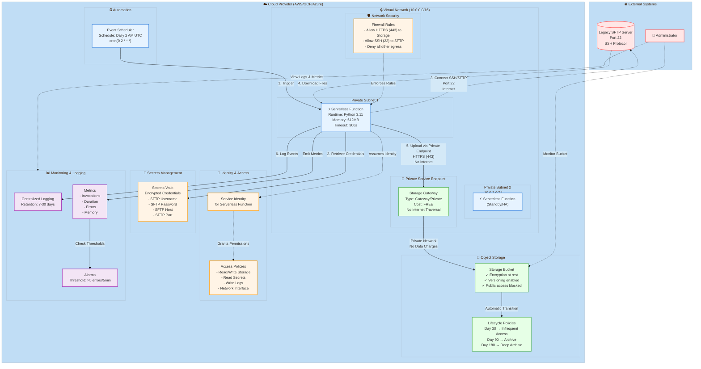

# Cloud-Agnostic Architecture Diagram
# Universal infrastructure diagram using Mermaid



## Architecture Components

### 1. **Virtual Network (VPC/VNet)**
- **Purpose**: Isolated network for secure compute resources
- **CIDR**: 10.0.0.0/16
- **Subnets**: 2 private subnets across availability zones

### 2. **Serverless Function**
- **Runtime**: Python 3.11
- **Memory**: 512 MB
- **Timeout**: 300 seconds (5 minutes)
- **Network**: Deployed in private subnets
- **HA**: Distributed across multiple zones

### 3. **Private Service Endpoint** ⭐ KEY COST SAVER
- **Type**: Gateway/Private endpoint to object storage
- **Cost**: **FREE** (saves ~$32/month vs NAT Gateway)
- **Benefit**: Private connectivity without internet traversal
- **Implementation**:
  - **AWS**: S3 VPC Gateway Endpoint
  - **GCP**: Private Google Access
  - **Azure**: Storage Service Endpoint

### 4. **Object Storage**
- **Features**:
  - Server-side encryption (AES-256)
  - Versioning enabled
  - Public access blocked
  - Lifecycle policies for cost optimization

### 5. **Network Security**
- **Firewall Rules**:
  - Allow HTTPS (443) to storage via private endpoint
  - Allow SSH (22) to legacy SFTP server
  - Deny all other outbound traffic

### 6. **Identity & Access Management**
- Service identity for serverless function
- Least privilege access policies
- No hardcoded credentials

### 7. **Secrets Management**
- Encrypted storage for SFTP credentials
- Accessed by function at runtime
- Automatic rotation support

### 8. **Monitoring & Logging**
- Centralized logging with configurable retention
- Metrics for performance tracking
- Alarms for error detection

### 9. **Automation**
- Scheduled trigger (daily, weekly, etc.)
- Event-driven execution

## Data Flow

```
┌─────────────┐
│  Scheduler  │ Daily at 2 AM UTC
└──────┬──────┘
       │
       ▼
┌─────────────────────────────────────────────┐
│  Step 1: Trigger Serverless Function        │
└──────┬──────────────────────────────────────┘
       │
       ▼
┌─────────────────────────────────────────────┐
│  Step 2: Retrieve SFTP Credentials          │
│  from Secrets Manager                       │
└──────┬──────────────────────────────────────┘
       │
       ▼
┌─────────────────────────────────────────────┐
│  Step 3: Connect to SFTP Server             │
│  (over internet, port 22)                   │
└──────┬──────────────────────────────────────┘
       │
       ▼
┌─────────────────────────────────────────────┐
│  Step 4: Download Files from SFTP           │
└──────┬──────────────────────────────────────┘
       │
       ▼
┌─────────────────────────────────────────────┐
│  Step 5: Upload to Object Storage           │
│  via Private Service Endpoint               │
│  (no internet, no NAT, FREE)                │
└──────┬──────────────────────────────────────┘
       │
       ▼
┌─────────────────────────────────────────────┐
│  Step 6: Log Execution Details              │
│  and Emit Metrics                           │
└─────────────────────────────────────────────┘
```

## Security Layers

### Network Security
- ✓ Private subnets (no direct internet for storage)
- ✓ Firewall rules (restrictive outbound)
- ✓ Private service endpoint (no internet traversal)

### Data Security
- ✓ Encryption in transit (SFTP, TLS/HTTPS)
- ✓ Encryption at rest (storage service)
- ✓ Versioning enabled

### Identity Security
- ✓ Service identity (no access keys)
- ✓ Least privilege IAM policies
- ✓ Secrets manager for credentials

### Monitoring Security
- ✓ Centralized logging
- ✓ Metrics and alarms
- ✓ Audit trail

## Cost Optimization

### Key Savings
1. **Private Service Endpoint**: FREE (saves $32/month vs NAT Gateway)
2. **Serverless Compute**: Pay per execution (~$0.25/month for 1000 executions)
3. **Lifecycle Policies**: Up to 96% savings on archived data
4. **Log Retention**: 7-30 days to minimize storage costs

### Monthly Cost Estimate (1000 executions, 100GB data)
| Component | Cost |
|-----------|------|
| Serverless Function | $0.25 |
| Object Storage (with lifecycle) | $2.00-2.30 |
| Storage Requests | $0.01 |
| Secrets Manager | $0.06-0.40 |
| Logging | $0.05 |
| Private Endpoint | **$0.00** (FREE) ⭐ |
| **Total** | **$2.37-3.01/month** |

**Savings vs NAT Gateway**: ~91-93% cost reduction

## High Availability

- Multi-zone deployment
- Automatic failover
- Distributed function instances
- Redundant storage (multiple copies)

## Scalability

- Serverless auto-scaling
- Concurrent executions
- No infrastructure management
- Pay per use

## Cloud Provider Equivalents

| Component | AWS | GCP | Azure |
|-----------|-----|-----|-------|
| Virtual Network | VPC | VPC Network | Virtual Network |
| Private Subnet | Subnet | Subnet | Subnet |
| Firewall | Security Group | Firewall Rules | NSG |
| **Private Endpoint** | **S3 Gateway Endpoint (FREE)** | **Private Google Access (FREE)** | **Service Endpoint (FREE)** |
| Serverless Function | Lambda | Cloud Functions / Cloud Run | Azure Functions |
| Object Storage | S3 | Cloud Storage | Blob Storage |
| Service Identity | IAM Role | Service Account | Managed Identity |
| Secrets | Secrets Manager | Secret Manager | Key Vault |
| Logging | CloudWatch Logs | Cloud Logging | Log Analytics |
| Metrics | CloudWatch | Cloud Monitoring | Azure Monitor |
| Scheduler | EventBridge | Cloud Scheduler | Logic Apps / Timer |
