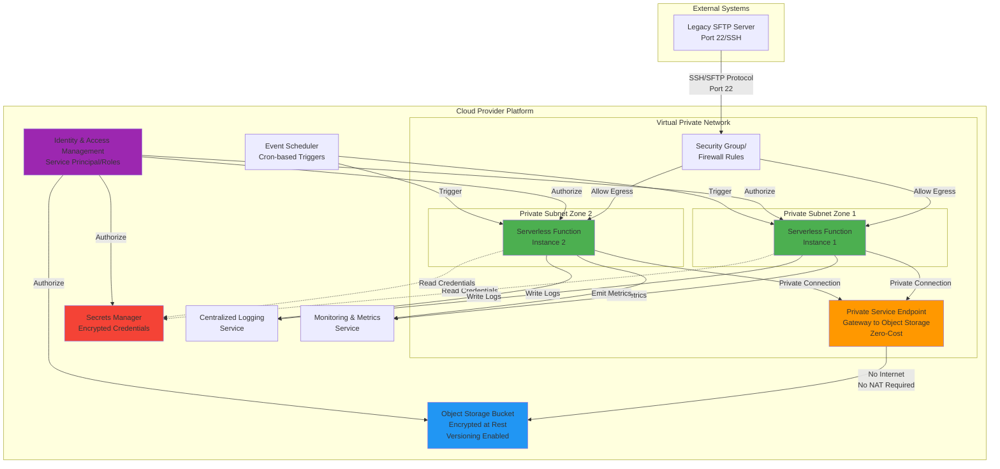
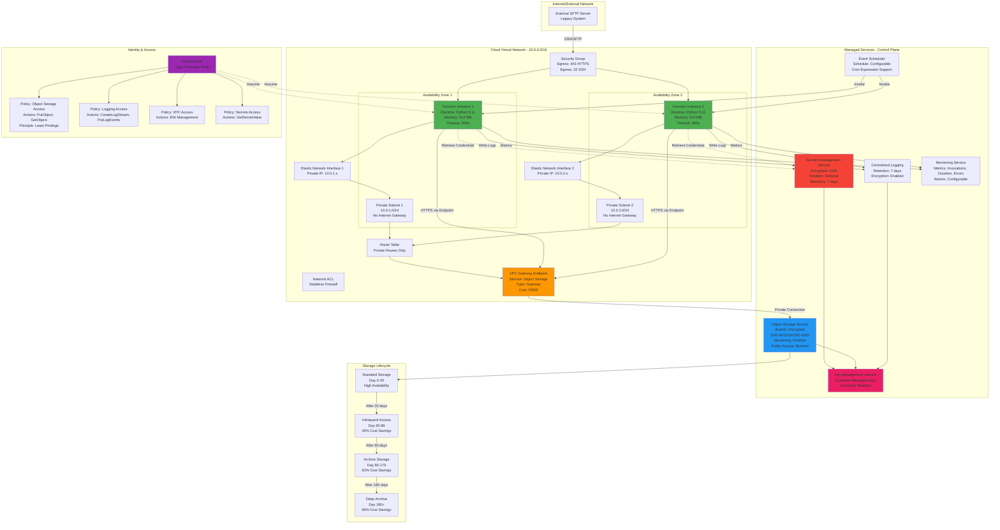
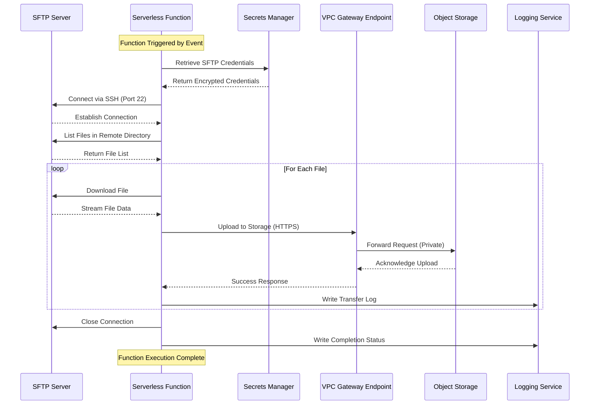
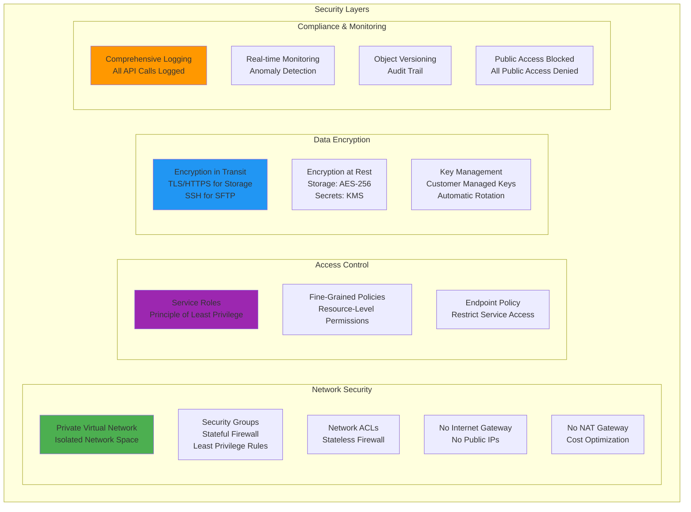
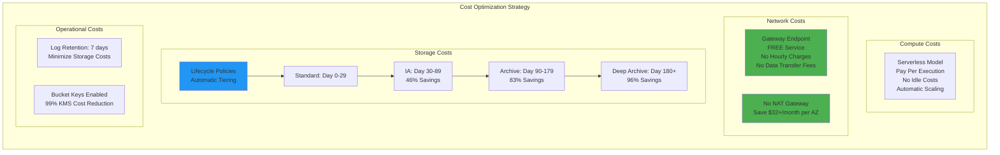
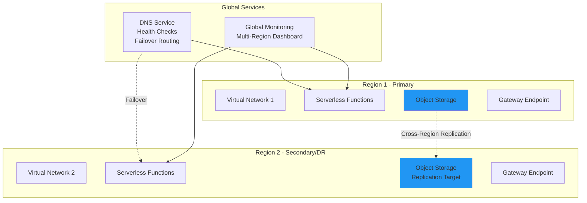
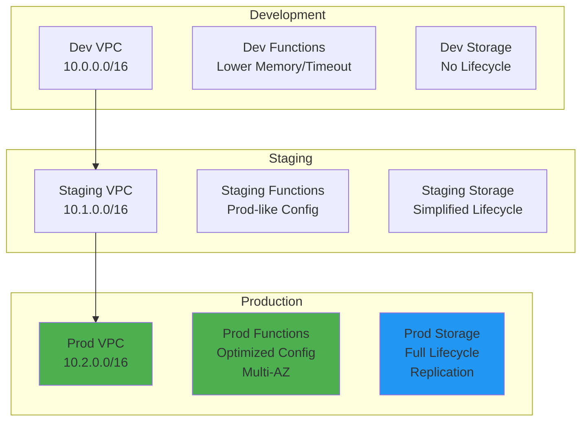

# Universal Infrastructure Diagram

## High-Level Architecture (Cloud-Agnostic)

## Detailed Component Diagram

## Network Flow Diagram

## Security Architecture

## Cost Optimization Architecture

## Multi-Region Architecture (Optional)

## Deployment Architecture Pattern

## Legend

### Colors
- 🟢 **Green**: Compute/Function Components
- 🟠 **Orange**: Network Endpoints
- 🔵 **Blue**: Storage Services
- 🔴 **Red**: Secrets/Sensitive Data
- 🟣 **Purple**: Identity & Access Management
- 🟤 **Pink**: Encryption Services

### Line Types
- **Solid Line** (→): Direct data flow or connection
- **Dashed Line** (-.->): Authentication/Authorization flow
- **Bold Line**: Primary data path

### Component Types
- **Rectangle**: Standard component
- **Rounded Rectangle**: Managed service
- **Cylinder**: Storage service
- **Diamond**: Decision point

## Notes

1. **All diagrams use cloud-agnostic terminology** that maps to specific services in AWS, GCP, or Azure
2. **Security is implemented at every layer** from network to application
3. **Cost optimization is a first-class concern** with multiple strategies employed
4. **High availability** is achieved through multi-AZ deployment
5. **Scalability** is inherent in the serverless architecture
6. **Monitoring and observability** are built-in from day one

For service-specific mappings to AWS, GCP, and Azure, see `cloud-service-mapping.md`.
